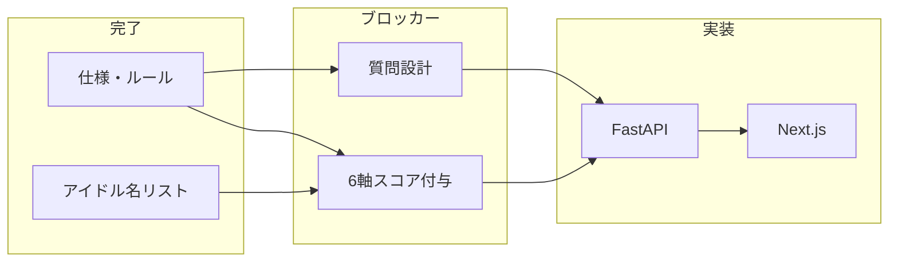
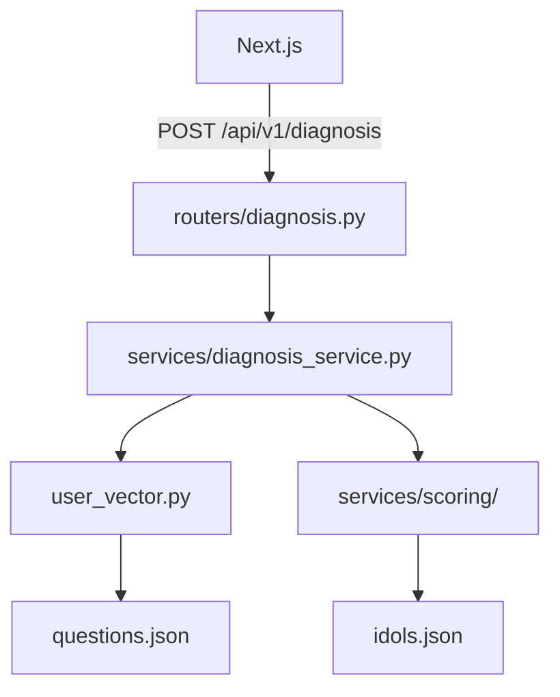
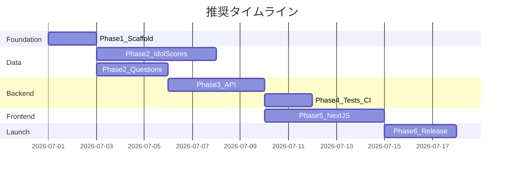

# 推しネーター — 大フェーズ開発計画

## 現状

| あるもの | ないもの |
|---------|---------|
| [README.md](README.md)（製品仕様・6軸定義・アルゴリズム） | アプリケーションコード全体 |
| [.cursor/rules/](.cursor/rules/)・[.cursor/skills/](.cursor/skills/) | `backend/`・`frontend/` |
| アイドル名リスト（38人分・スコア未付与） | 診断質問設計・回答→ベクトル変換ルール |
| | テスト・CI/CD・デプロイ設定 |



---

## Phase 1: プロジェクト基盤（スキャフォールド）

**目的:** 開発を始められる最小構成を揃える。

**成果物:**
- ルート [`.gitignore`](.gitignore)（Python / Node / `.env`）
- [`backend/`](backend/) — FastAPI 骨格
  - `main.py`、`routers/`・`services/`・`schemas/` 空ディレクトリ
  - `pyproject.toml`（FastAPI, uvicorn, pydantic, pytest, ruff）
  - `GET /health` のみ動作確認
- [`frontend/`](frontend/) — **Next.js App Router**（TypeScript, ESLint）
  - トップページに仮タイトル表示
- ルート [`README.md`](README.md) に開発コマンド追記（起動・lint・test）
- [`.cursor/rules/project-core.mdc`](.cursor/rules/project-core.mdc) に lint/test コマンドを追記

**完了条件:** バックエンド `localhost:8000/health`、フロント `localhost:3000` が同時起動できる。

---

## Phase 2: ドメインデータ設計（最重要ブロッカー）

**目的:** アルゴリズムの入力データを確定する。コードより先にここを終わらせる。

### 2a. アイドルマスターデータ

- 既存の38人リストを [`backend/data/idols.json`](backend/data/idols.json)（または YAML）に格納
- README §6.1 形式に統一:

```json
{
  "idol_id": "idol_001",
  "name": "...",
  "scores": {
    "relationship": 0.0,
    "performance": 0.0,
    "visual": 0.0,
    "character": 0.0,
    "age_attribute": 0.0,
    "behavior": 0.0
  }
}
```

- **スコア付与ルーブリック**を別ドキュメント（例: `docs/scoring-rubric.md`）に定義
  - 各軸の -1.0 / 0 / +1.0 の判断基準を具体例付きで記載
  - ルール: **推測で捏造しない**（[project-core.mdc](.cursor/rules/project-core.mdc)）→ ルーブリックに沿った根拠付きで付与
- 38人全員のスコア入力・レビュー

### 2b. 診断質問設計

README に質問仕様がないため、新規設計が必要。

- 質問数・形式を決定（例: 各軸2問 × 6軸 = 12問、5段階リッカート）
- [`backend/data/questions.json`](backend/data/questions.json) に質問マスター
- **回答 → 6軸ベクトル変換ルール**を明文化（例: 軸ごとに回答を正規化して平均）
- 変換ロジックは [diagnosis-algorithm SKILL](.cursor/skills/diagnosis-algorithm/SKILL.md) の「User vector generation logic is separate from matching logic」に従い、マッチングと分離

**完了条件:** `idols.json`（38人・全軸スコア済み）と `questions.json`（変換ルール付き）がレビュー済み。

---

## Phase 3: バックエンドコア（診断 API）

**目的:** 3層アーキテクチャで診断エンドポイントを実装する。[fastapi-endpoint SKILL](.cursor/skills/fastapi-endpoint/SKILL.md) に沿う。



**実装順:**

1. **schemas/** — `DiagnosisRequest`（回答配列）、`DiagnosisResponse`（推薦アイドル + 任意で軸スコア）、`AxisScores`（6軸キー名統一）
2. **services/scoring/** — Strategy パターン
   - デフォルト: ユークリッド距離（またはコサイン距離）
   - インターフェースで差し替え可能
   - **同距離タイブレーク規則**を定義（例: `idol_id` 辞書順）
3. **services/** — `load_idols()`、`generate_user_vector(answers)`、`find_best_match(user_vector)`
4. **routers/** — 薄い `POST /api/v1/diagnosis`
5. **CORS** — フロント `localhost:3000` を許可

**完了条件:** curl / Swagger で回答を送ると最適アイドルが返る。マスターデータは Router から直接読まない。

---

## Phase 4: バックエンド品質（テスト・静的解析）

**目的:** スコア計算の正しさを担保する。

- `pytest` — スコアリング Strategy の単体テスト（既知ベクトルで最近傍が期待通り）
- 診断サービスの結合テスト（固定回答 → 固定アイドル）
- `POST /diagnosis` の API テスト（`TestClient`）
- `ruff` lint / 型チェック（`mypy` または pyright）
- GitHub Actions（`.github/workflows/backend-ci.yml`）で PR 時に自動実行

**完了条件:** CI が green。スコアリング関連のテストはスキップ不可（SKILL Step 5 準拠）。

---

## Phase 5: フロントエンド（診断 UX）

**目的:** Next.js App Router で診断フローを完成させる。[typescript-frontend.mdc](.cursor/rules/typescript-frontend.mdc) 準拠。

**画面構成（最小）:**

| 画面 | 内容 |
|------|------|
| `/` | ランディング・診断開始 |
| `/diagnosis` | 質問を1問ずつ（または一覧）表示、回答収集 |
| `/result` | 推薦アイドル名・簡単な説明・再診断リンク |

**技術:**
- `frontend/src/types/` — バックエンド schemas と整合する TypeScript 型
- `frontend/src/lib/api.ts` — `POST /api/v1/diagnosis` クライアント
- 環境変数 `NEXT_PUBLIC_API_URL`
- 文言は日本語（推し活初心者向けトーン）
- ローディング・エラー表示

**完了条件:** ブラウザで質問回答 → 結果表示まで一連のフローが動作。

---

## Phase 6: 統合・リリース準備

**目的:** 本番相当の品質とデプロイ経路を整える。

- **E2E** — Playwright 等で診断フロー1本（任意だが推奨）
- **デプロイ**
  - Frontend: Vercel（Next.js）
  - Backend: Railway / Render / Fly.io 等（FastAPI + uvicorn）
  - CORS・環境変数の本番設定
- **フロント CI** — ESLint + `tsc --noEmit` + ビルド
- **OGP・メタ** — SNS シェア用（診断結果ページ）
- **README** — デプロイ手順・環境変数一覧

**完了条件:** ステージング or 本番 URL で診断が完走できる。

---

## 推奨実行順と並行作業



- **今すぐ着手:** Phase 1（スキャフォールド）
- **Phase 1 と並行可能:** Phase 2a のルーブリック策定・スコア付与（人間作業が主）
- **Phase 3 着手条件:** Phase 2b（質問設計）が最低限完了。2a はプレースホルダー数人で API 開発開始 → 全38人スコア確定後に差し替えも可
- **Phase 5 着手条件:** Phase 3 の API が動作（モックでも可、早めに型を固める）

---

## 次のアクション（承認後）

1. **Phase 1 を実行** — `backend/` + `frontend/`（Next.js）スキャフォールド、`/health` 疎通
2. **Phase 2 を並行開始** — スコアルーブリック草案 + 診断質問のたたき台（12問程度）を作成
3. 既存のアイドル名リストをリポジトリに追加（`backend/data/idols.json` の名前欄のみ先行投入）
